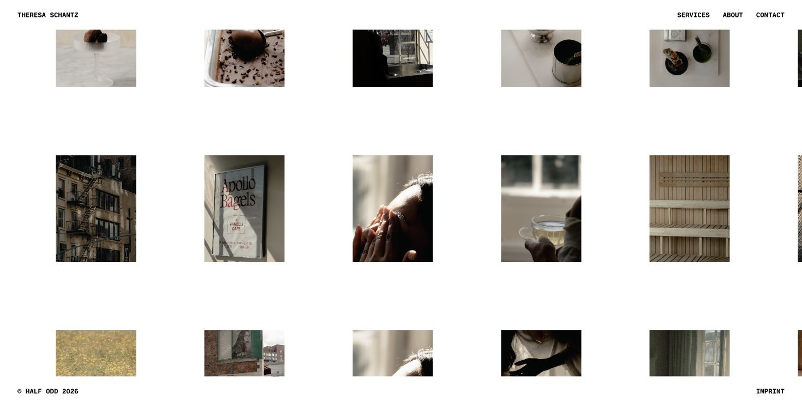

# Theresa Schantz - Photography

My photography portfolio.

The site brings together personal and commissioned photography with a focus on people, atmosphere, light, and the details that make a place or moment feel particular.

Photography sits alongside my work in design and software and is an important part of how I think about composition, color, rhythm, and visual storytelling.

## The site

The portfolio is designed to keep the interface secondary to the images.

It focuses on:

- large-format photography
- restrained typography
- responsive image layouts
- simple navigation
- minimal interface chrome

## Built with

- React
- TypeScript
- Vite
- CSS

## Live

[theresaschantz.com](https://www.theresaschantz.com/)

## More

For my design and software work, visit [Half Odd](https://www.halfodd.com/).
